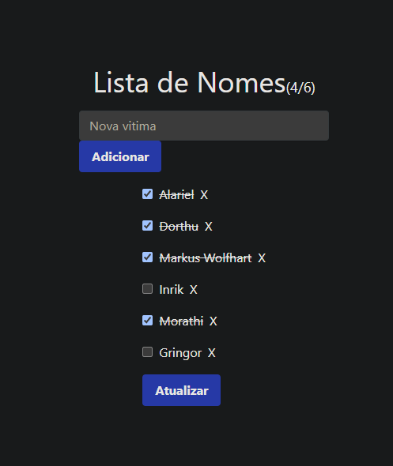

# Projeto de Lista de Nomes

## Descrição

Este é um projeto focado em implementar uma lista de nomes utilizando HTMX, um mecanismo que facilita a criação de interações dinâmicas entre o frontend e o backend.

## Funcionalidades

- Adição de novos nomes à lista.
- Marcação de nomes como concluídos.
- Remoção de nomes da lista.

## Tecnologias Utilizadas

- **Python:** Linguagem de programação principal.
- **Bottle:** Framework web para Python.
- **HTMX:** Biblioteca para atualizações dinâmicas no lado do cliente.
- **SQLite:** Banco de dados para armazenamento dos nomes.

## Estrutura de Pastas

```
htmx_teste_inicial/
│
├── servidor.py
├── lista.py
├── index.html
└── README.md
├── requirement.txt
```


- `servidor.py`: Contém a lógica do servidor web.
- `lista.py`: Funções para o DB, lógica do negocio.
- `index.htm`: index...
- `rquirement.txt`: O que precisa para utilizar.
- `README.md`: Este arquivo.

## Como Executar

### Pré-requisitos

- Python 3 instalado
- Bibliotecas: `bottle`, `htmx`

### Passos para Execução

1. Clone o repositório: `git clone https://github.com/Hargenx/nhtmx_teste_inicial.git`
2. Acesse o diretório: `cd htmx_teste_inicial`
3. Instale as dependências: `pip install -r requirements.txt`
4. Execute o servidor: `python servidor.py`
5. Acesse no navegador: `http://127.0.0.1:8080`


## Contribuição

Contribuições são bem-vindas! Sinta-se à vontade para abrir uma issue ou um pull request para melhorias.

## Licença

Este projeto está licenciado sob a [Licença MIT](https://opensource.org/licenses/MIT) - veja o arquivo [LICENSE](LICENSE) para mais detalhes.

---

Criado por [Raphael M. S. de Jesus](https://github.com/Hargenx).

